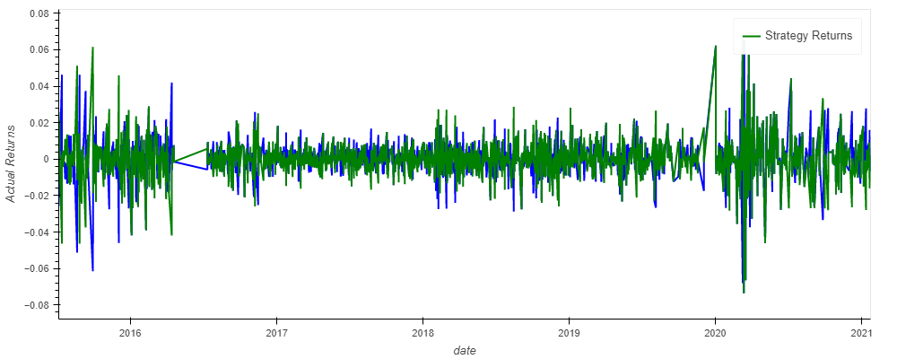
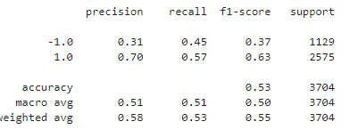
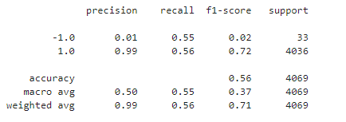
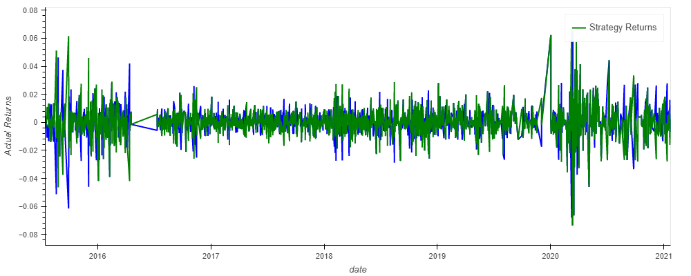
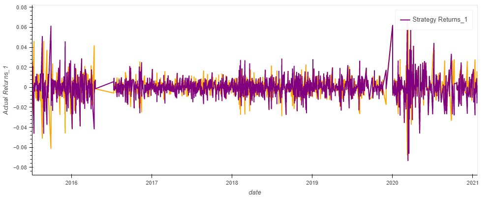

# Trading Algorithm Performance Report 

## Baseline Trading Algorithm 

The Baseline Trading ALgorithm strategy returns are very similar to the actual returns. The model has a high percission; however, the recall is not high. The strategy returns resemble the actual returns; however, in some cases they ar opposite of the actual returns as observed in the ggraph below.  

## Tuning Baseline Trading Algorithm

### Step 1: Tune the training algorithm by adjusting the size of the training dataset. 

*To do so, slice your data into different periods. Rerun the notebook with the updated parameters, and record the results in your README.md file.
Answer the following question: What impact resulted from increasing or decreasing the training window?*

A training window of 9 months was used instead of the original 3 month trainiing window. The results of the training algorithm are very similar to the model training with the original window As observed in the graph below, the strategy returns are very similar to the returns in the original graph.  

### Step 2: Tune the trading algorithm by adjusting the SMA input features.  

*Adjust one or both of the windows for the algorithm. Rerun the notebook with the updated parameters, and record the results in your `README.md` file. 
Answer the following question: What impact resulted from increasing or decreasing either or both of the SMA windows?*

### Step 3: Choose the set of parameters that best improved the trading algorithm returns. 

*Save a PNG image of the cumulative product of the actual returns vs. the strategy returns, and document your conclusion in your `README.md` file.*

## LogisticRegression  

Did this new model perform better or worse than the provided baseline model? Did this new model perform better or worse than your tuned trading algorithm?